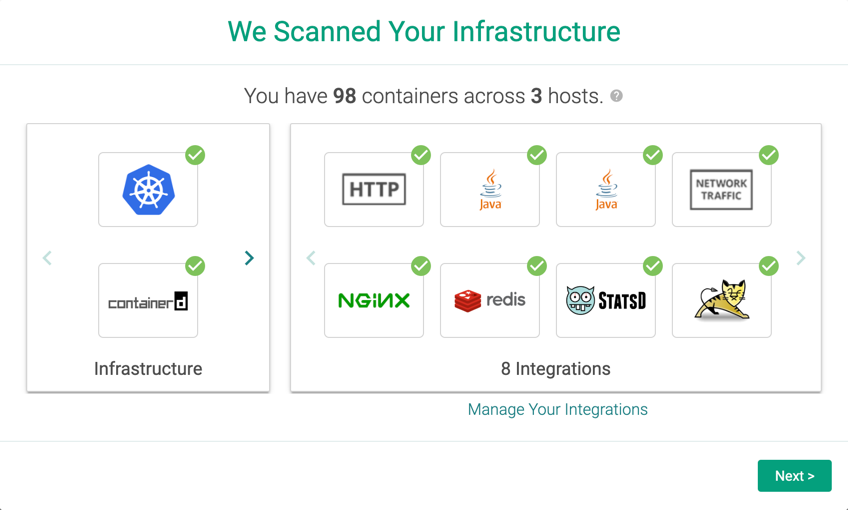
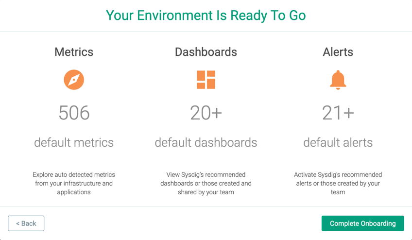

# Sysdig Setup

Complete the steps for setting up the Sysdig tool

## Overview

Sysdig is the environment's monitoring tool](./tools/sysdig). Before you can use it as part of the environment, you must finish setting up the new instance.

## Setup

Finish setting up the new Sysdig instance. If this is your first time opening the Sysdig dashboard, Sysdig will open a platform dialog and an Onboarding wizard.

Select the platform
- On the Welcome to Sysdig Monitor panel click **Next**
- Choose **Kubernetes | GKE | OpenShift** as the installation method
- The agent is already installed in the cluster, so click **Go to next step!** to access the dashboard

Configure the monitoring agent

- The first page shows the hosts (i.e. Kubernetes nodes) and containers that Sysdig found, as well as the integrations it has selected to monitor them

    

    Notice there are different types of integrations for different types of runtimes such as Java, servers such as Tomcat, and even infrastructure integrations for monitoring the Kubernetes cluster itself and its containerd engines.

- Press **Next**
- The second page shows the predefined metrics, dashboards, and alerts that Sysdig will start using to monitor the apps in your cluster

    

- Press **Complete Onboarding**

## Conclusion

The environment's Sysdig instance is now setup and ready for developers to use.
