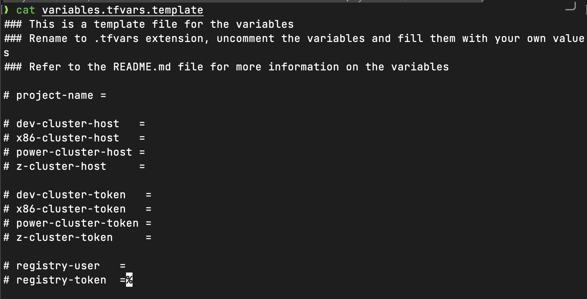
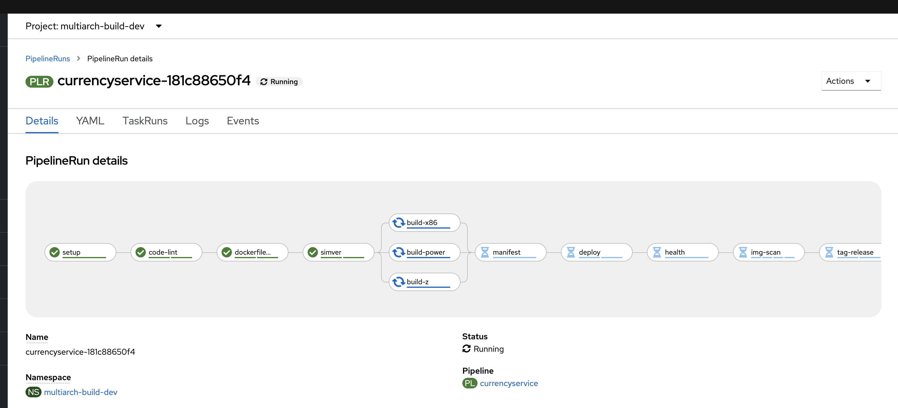
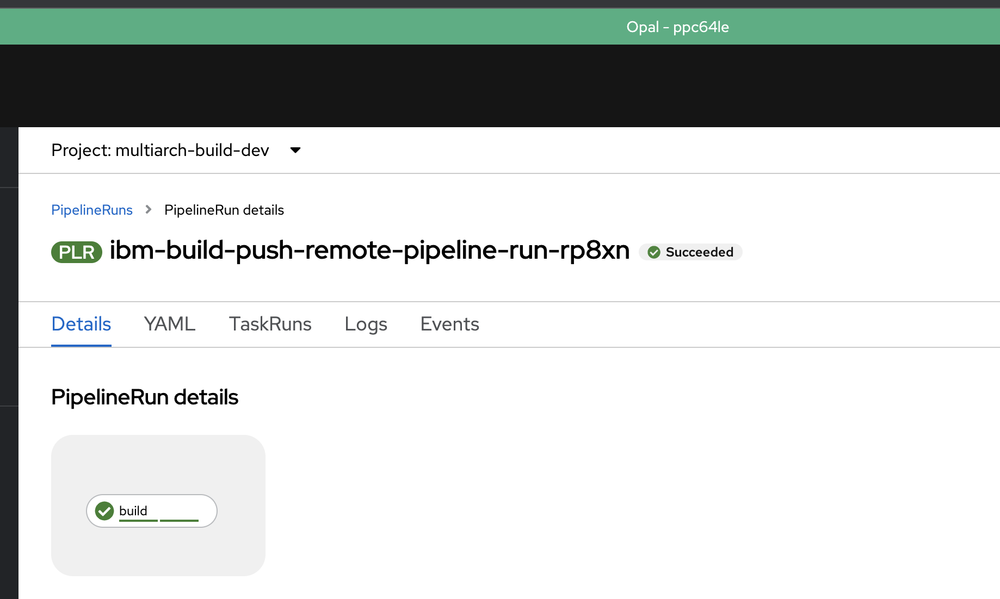
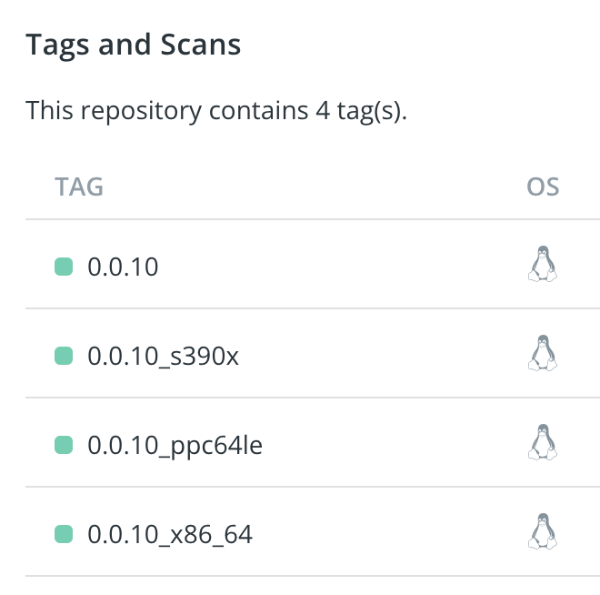

# Build multiarchitecture images

<!--- cSpell:ignore CICD cntk pipelinerun Omni Frontends cloudnative multiarchitecture multiarch tfvars sivmer -->

Build multiarchitecture images using the Cloud Native Toolkit, Tekton pipelines and ArgoCD.
The resulting images can be deployed to any OpenShift cluster running on x86, IBM Z (s390x) or IBM Power (ppc64le).

## Overview

This is a setup to build images using the Cloud Native Toolkit, Tekton pipelines and ArgoCD, following a DevSecOps approach. The workflow we are trying to achieve is the following :

## Build a multiarchitecture microservice

### Prerequisites

| Task                                                            | Instructions                                                        |
| --------------------------------------------------------------- | ------------------------------------------------------------------- |
| An x86 OpenShift **development cluster**                        | You will need admin access to this cluster for the setup            |
| x86, IBM Z and IBM Power OpenShift **workload clusters**        | You will need admin access to this cluster for the setup            |
| Install the Cloud Native Toolkit on the **development cluster** | [Install the Cloud Native Toolkit](../../../setup/setup-options.md) |

### Setup the clusters

The **workload clusters** serve two purposes :

1.  They are used to build _remotely_ the images for the x86, IBM Z and IBM Power architectures; they act as agents for the build process.
2.  They _can_ be used to deploy the images to the x86, IBM Z and IBM Power architectures, granted if ArgoCD is configured to deploy the images to the workload clusters.

We are using the clusters as agents because we cannot build multiarchitecture images on the same development cluster.

The build is performed remotely, the dev cluster needs access to trigger the build pipelines on the workload clusters. A setup is needed in order to perform this remote build.

A Terraform script is available [here](https://github.com/ibm-ecosystem-lab/multiarch-build-clusters-setup). A template file is available, you can find explanations in the repository.

The script should take care of the following :

- Setup remote pipeline execution, including the creation of the required secrets to access the image registry where the images will be pushed.
- Create the pipelines and tasks to build the images under the `Tools` project if not already done.
- Create the required projects and services on the development and workload clusters. The projects names will follow the convention :
  - `<PROJECT_NAME>-dev`
  - `<PROJECT_NAME>-test`
  - `<PROJECT_NAME>-prod`
    The test and prod project refer to deployment environments that could be used later on by ArgoCD. These two projects only exist on the workload clusters as we are not deploying the images to the development cluster.

!!! note
    Deploying the images in a **multi-cloud/cluster** environment requires more setup, using [Red Hat Advanced Cluster Management (RHACM)](https://www.redhat.com/en/technologies/management/advanced-cluster-management) and the [Submariner add-on](https://submariner.io/).

### Run the Tekton pipelines

Using the `igc pipeline` command, we can run the Tekton pipelines. The services we will be using are available [here](https://github.com/ibm-ecosystem-lab/multiarch-deployment-showcase-repos). Login to the development cluster, select the `dev` project and run the command :

!!! note
    The git credentials are only used to create webhooks for the pipelines, wrong git credentials will not prevent the pipeline to run, but code changes on the git repository will not trigger automatically the pipeline.

We can check afterwards the pipeline execution on the dev cluster :

### Pipeline execution

The multiarch pipeline showcased here is an extension of the CI pipelines found [here](/learning/pipeline/). They mostly the same tasks, with some additional ones to perform multiarchitecture builds.

- `simver` : This step uses the same logic as the `tag-release`step that uses the `ibm-tag-release` Tekton task, with the difference that no new tag in being released on the code repository.
- `build-x86`, `build-power` and `build-z` : These steps build remotely the images for the x86, IBM Power and IBM Z architectures. The dev cluster connects to workload clusters and triggers a 1-step build pipeline that pushes the image afterwards to the image registry.
  
  
  
  After each build, the images are pushed to the image registry, tagged with the code version and an architecture label. In this example we are using [quay.io](https://quay.io) but any image registry can be used.
- `manifest` : This step creates a manifest file for the images; when pulling the images, the manifest will serve as a pointer to the appropriate image depending on the architecture of the pulling machine.

After the execution of these steps, we should have this result depending on the image registry used :

- On [Quay](https://quay.io) :
  

- On [Dockerhub](https://hub.docker.com) :  
  

Your image registry contains now a multiarchitecture image of your service. You can deploy this image to any workload clusters traditionally or using ArgoCD following the [GitOps methodology](/adopting/best-practices/devops/#what-is-gitops).

## Deploy a hybrid multi-cloud application

So far this tutorial showed how to build one service into a multiarchitecture image that can run on x86, IBM Power and IBM Z using OpenShift. But we can actually deploy multiple services using multiple cluster and have them communicate with each other in a hybrid multi-cloud environment. This is done using Red Hat Advanced Cluster Management with the [Submariner](https://submariner.io) add-on.  
If you wish to have a more in-depth showcase, [this Terraform script](https://github.com/ibm-ecosystem-lab/multiarch-build-demo-setup) uses this same multiarchitecture build pattern to deploy a fully functionning marketplace application that runs accross multiple OpenShift clusters, following a DevSecOps approach using the toolkit and a GitOps deployment and placement strategy with ArgoCD.

!!! warning
    This script will not cover the setup of RHACM and Submariner, these should be available before running the automation.

The resulting application will follow this architecture :

