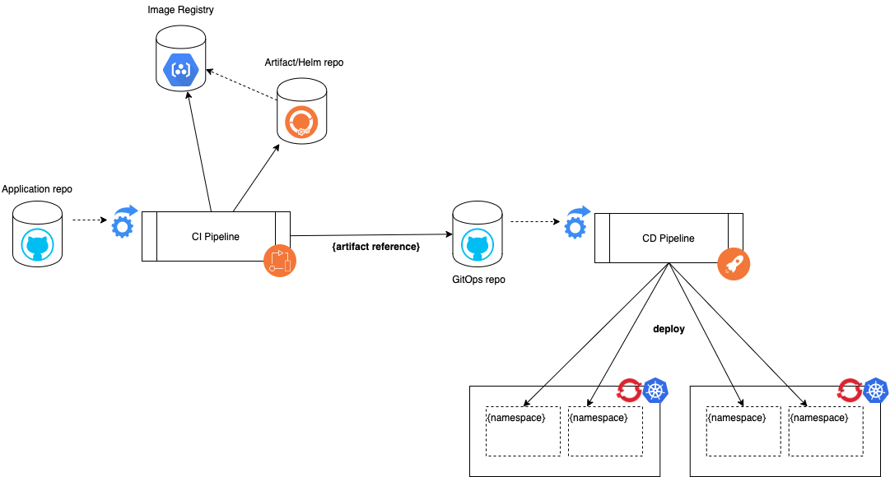

# Dev-Ops Concepts

<!--- cSpell:ignore grpc jsonnet ksonnet Multicloud -->

This short video introduces the concepts of DevOps with Red Hat OpenShift:

Click the image below to launch the video

{: target=_blank}

## Continuous Delivery

In IBM Garage Method, one of the **Develop** practices is [continuous delivery](https://www.ibm.com/garage/method/practices/deliver/practice_continuous_delivery/).

A preferred model for implementing continuous delivery is GitOps, where the desired state of the operational environment is defined in a source control repository (namely Git).

## What is continuous delivery

Continuous delivery is the DevOps approach of frequently making new versions of an application's components available for deployment to a runtime environment. The process involves automation of the build and validation process and concludes with a new version of the application that is available for promotion to another environment.

Continuous delivery is closely related to continuous deployment. The distinction is:

- Continuous delivery deploys an application when a user manually triggers deployment
- Continuous deployment deploys an application automatically when it is ready

Typically, continuous deployment is an evolution of a continuous delivery process. An application is ready for deployment when it passes a set of tests that prove it doesn't contain any significant problems. Once these tests have been automated in a way that reliably verifies the application components then the deployment can be automated. Additionally, for continuous delivery it important to employ other best practices around moving and managing changes in an environment: blue-green deployments, shadow deployments, and feature toggles to name a few. Until these practices are in place and verified, it is best to stick with continuous delivery.

As with most cloud-native practices, the move from continuous deployment to continuous delivery would not be done in a "big bang" but incrementally and as different application components are ready.

### What is GitOps

[*GitOps*](https://www.weave.works/technologies/gitops/) is the operational pattern of using source code repositories (namely Git) as the source of truth for defining the configuration that makes up the desired state of the operational environment. Git repositories are used to declaratively represent the desired state of applications in deployment environments.

GitOps takes advantage of several Git features:

- Git provides a versioned history of changes, listing what was changed and who made the change
- Change releases can be managed from a pull request, allowing multiple people to make changes but a select few to approve the changes
- Git provides access control mechanisms to limit who can change and view the configuration
- Git enables changes to be rolled back quickly if there is an issue with a new release
- Git supports multiple models for change management: Branches, Forks, GitFlow, etc
- Hosted git providers (like GitHub) provide a rich API that allows the different operations to be automated, if desired

### CI/CD integration

For the full end-to-end build and delivery process, both the CI and CD pipelines are used. When working in a containerized environment such as Kubernetes or Red Hat OpenShift, the responsibilities between the two processes are clearly defined:

- The **CI pipeline** is responsible for building validating and packaging the "raw materials" (source code, deployment configuration, etc) into versioned, deployable artifacts (container images, helm charts, published artifacts, etc)
- The **CD pipeline** is responsible for applying the deployable artifacts into a particular target environment

1. A change made to one of the source repositories triggers the CI process.

2. The CI process builds, validates, and packages those changes into deployable artifacts that are stored in the image registry and artifact repository(ies).

3. The last step of the CI process updates the GitOps repository with information about the updated artifacts.

    At a minimum this step stores updates the version number to the newly released versions of the artifacts but depending on the environment this step might also update the deployment configuration.

    !!!Note
        It is also possible to trigger a process when a new image is available in the image registry or a new artifact is available to the artifact management system.

        In this case, the CI process could be split into two parts: 
        
            1. create the container image and artifacts, and 
            2. update the GitOps repo with the available artifacts.

4. Changes to the GitOps repository trigger the CD pipeline to run

5. In the CD pipeline, the configuration describing the desired state as defined in the GitOps repository is reconciled with the actual state of the environment and resources are created, updated, or destroyed as appropriate.

## Tools to support Continuous Delivery

The practice of (CD) can be accomplished in different ways and with different tools. It is possible and certainly valid to use the same tool for both CI and CD (e.g. Tekton or Jenkins) with caution you enforce a clear separation between the two processes. Typically, that would result in two distinct pipelines to respond to changes that happen within the two different Git repositories - source repo and gitops repo.

Another class of tools is available that are particularly suited for Continuous Delivery and GitOps. The following is by no means an exhaustive list but it does provide some of the common tools used for CD in a cloud-native environment:

- [ArgoCD](../reference/tools/argocd.md){: target=_blank}
- [Flux](https://fluxcd.io){: target=_blank}
- [IBM Multicloud Manager](https://www.ibm.com/cloud/cloud-pak-for-management){: target=_blank}
