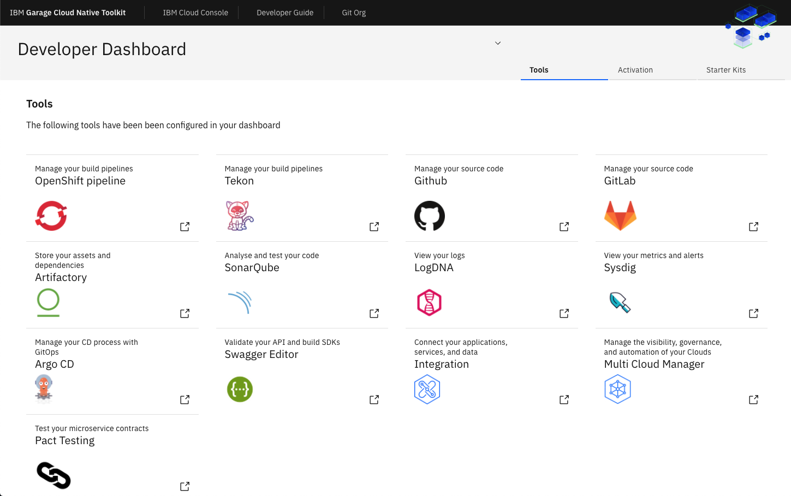
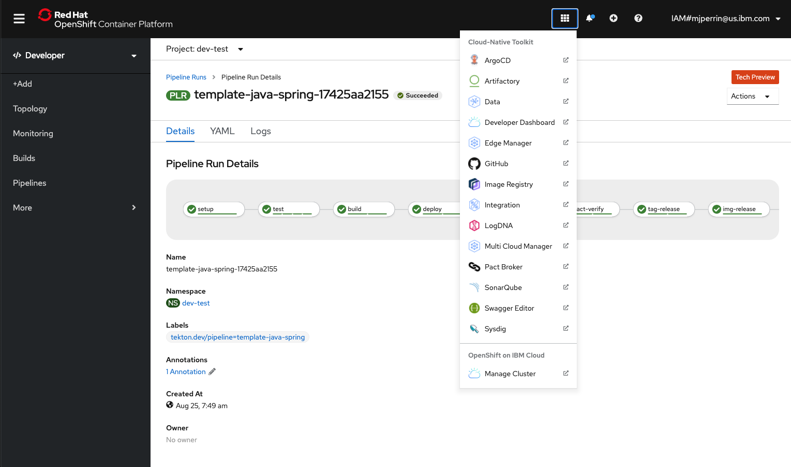

# Developer Dashboard

Explore the resources at your fingertips provided by the Cloud-Native Toolkit Developer Dashboard

The Developer Dashboard is one of the tools running in your developer environment. It is designed to help you navigate
to the installed tools and provide a simple way to perform common developer tasks, such as:

- **Dashboard**: Navigate to the tools installed in the cluster
- **Activation**: Links to education to help you learn cloud-native development and deployment using IBM Cloud Kubernetes Service and Red Hat OpenShift on IBM Cloud
- **Starter Kits**: Links to templates that will help accelerate your project

With the release of Red Hat OpenShift 4.x**, it is now even easier for developers to integrate the SDLC tools into the OpenShift console. This Developer Dashboard is mainly focused on providing a simple navigation experience when the Cloud-Native Toolkit is installed into IBM Cloud Kubernetes Service.



Here are some recent improvements:
- More tools can be added to the dashboard using a simple `igc tool-config` command
- Prefix (shown above as "IBM") and Title (shown above as "Cloud Native Toolkit") can be customized to you own names
- The IBM Cloud link can be overidden to support links to other cloud vendors when OpenShift is running on Azure, AWS, Google Cloud, or VMWare
- The tools view is split into more columns to enable more reuse of the screen
- The Cluster information is now available when you click on "Developer Dashboard" title
- The Toolkit CLI now installs an alias into the `oc` and `kubectl` so it is now possible to open the dashboard quickly using `oc dashboard` and `kubectl dashboard`

### Tools configured with OpenShift console

When the administrator configures your developer environment, they can customize a set of short cut links to common
tools you often use as a developer.



You can see how these tools are configured by reading the [tools configuration guide](../adopting/customize/config-dashboard/dashboard.md)

### Opening the Dashboard

You can open the Dashboard from a terminal.

1. Open a terminal
2. Make sure your terminal is logged into your cluster
    - In the IBM Cloud console, navigate to your cluster's overview
    - Switch to the **Access** tab
    - Follow the instructions to log in from the command line
3. Use the [Toolkit CLI (*igc*)](../reference/cli.md#dashboard) to open the Dashboard in your environment

=== "OpenShift"

    ```shell
    oc dashboards
    ```
=== "Kubernetes"

    ```shell
    kubectl dashboard
    ```
=== "Toolkit CLI"

    ```shell
    igc dashboard
    ```
    </Tab>
    </Tabs>

    The command should print the url to the dashboard then open the default browser to the url.

### Opening the Kubernetes/OpenShift console

- Use the [Toolkit CLI](../reference/cli.md) `console` command to open the IKS or OpenShift console:

    <Tabs>
    <Tab label="OpenShift">

    ```shell
    oc console
    ```

    </Tab>
    <Tab label="Kubernetes">

    ```shell
    kubectl console
    ```

    </Tab>
    <Tab label="Toolkit CLI">

    ```shell
    igc console
    ```

    </Tab>
    </Tabs>

    This command will determine the type of cluster (IKS or OpenShift), get the url for the console, and launch
    the url in the default browser. If the default browser is not available then the url will be printed to the
    screen.

### Access the URLs to endpoints in the cluster

- Use the [Toolkit CLI](../reference/cli.md) `endpoints` command to list the endpoints for a given namespace/project:

    <Tabs>
    <Tab label="OpenShift">

    ```shell
    oc endpoints -n tools
    ```

    </Tab>
    <Tab label="Kubernetes">

    ```shell
    kubectl endpoints -n tools
    ```

    </Tab>
    <Tab label="Toolkit CLI">

    ```shell
    igc endpoints -n tools
    ```

    </Tab>
    </Tabs>

    This will return the route and ingress URLs for the `tools` namespace where the DevOps tools have been installed in the cluster:

    ```shell
    ? Endpoints in the 'tools' namespace. Select an endpoint to launch the default browser or 'Exit'.

     1) Exit
     2) developer-dashboard - http://dashboard.garage-dev-ocp4-c-518489-0143c5dd31acd8e030a1d6e0ab1380e3-0000.us-east.containers.appdomain.cloud
     3) argocd-server - https://argocd-tools.gsi-learning-ocp311-clu-7ec5d722a0ab3f463fdc90eeb94dbc70-0001.eu-gb.containers.appdomain.cloud
     4) artifactory - https://artifactory-tools.gsi-learning-ocp311-clu-7ec5d722a0ab3f463fdc90eeb94dbc70-0001.eu-gb.containers.appdomain.cloud
     5) dashboard - https://dashboard-tools.gsi-learning-ocp311-clu-7ec5d722a0ab3f463fdc90eeb94dbc70-0001.eu-gb.containers.appdomain.cloud
     6) developer-dashboard - http://dashboard.garage-dev-ocp4-c-518489-0143c5dd31acd8e030a1d6e0ab1380e3-0000.us-east.containers.appdomain.cloud
    (Move up and down to reveal more choices)
     Answer:
    ```

    You can then select the URL and launch it in the default browser.

### Credentials

In the future, the tools in the Dashboard will be linked using a single sign-on (SSO) service. In the meantime, the CLI includes a command to list the tools' logins.

- Use the [Toolkit CLI](../reference/cli.md) `credentials` command to list the endpoints and credentials for the tools

    <Tabs>
    <Tab label="OpenShift">

    ```shell
    oc credentials
    ```

    </Tab>
    <Tab label="Kubernetes">

    ```shell
    kubectl credentials
    ```

    </Tab>
    <Tab label="Toolkit CLI">

    ```shell
    igc credentials
    ```

    </Tab>
    </Tabs>

    The command lists the `userid` and `password` for each tool installed. You can use these credentials to log into
    each of the installed tools.
    More of the tools in Red Hat OpenShift will be integrated into the OpenShift console login process

    !!!Note
        If you are using OpenShift, the Jenkins credential will be `undefined` because the OpenShift built in Jenkins service uses IBM cloud single sign-on mechanism.
