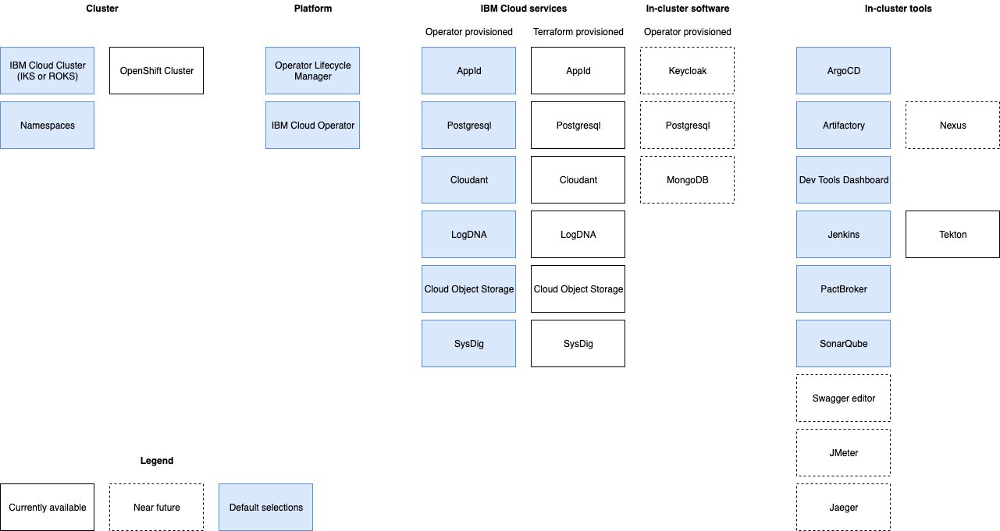

# Iteration Zero

Iteration Zero is the name of the process of installing and setting up the toolkit.  

The toolkit uses [infrastructure as code](../../adopting/best-practices/infrastructure-as-code.md){: target=_blank} using [Terraform](https://www.terraform.io){: target=_blank} as the primary means of coordinating and performing the many component installs needed by the toolkit.

The fast-start install uses all the default values provided by the modules to deliver a generic install of the Toolkit, but as you adopt the Toolkit you may want to customize the Iteration Zero process.

The Iteration Zero logic is stored in two repositories:

- `garage-terraform-modules`

    The modules that provide logic to provision individual components of the infrastructure. These modules cover one of three different categories: infrastructure (e.g. create a kubernetes cluster), cloud service, or software deployed and configured into a cluster. [https://github.com/cloud-native-toolkit/garage-terraform-modules](https://github.com/cloud-native-toolkit/garage-terraform-modules){: target=_blank}

- `ibm-garage-iteration-zero`

    The logic that makes use of the modules with specific configuration parameters used to deliver an entire solution.
    [https://github.com/cloud-native-toolkit/ibm-garage-iteration-zero](https://github.com/cloud-native-toolkit/ibm-garage-iteration-zero){: target=_blank}

This guide will walk through the various files that make up the Infrastructure as Code components and how to customize them. The [Installation Overview](../../adopting/setup/installing.md){: target=_blank} walks through how to perform an install with the Iteration Zero scripts.

## Iteration Zero terraform scripts

The Iteration Zero terraform scripts make use of the modules to provision and prepare an environment. The logic is
provided as `stages` that can be removed and added as needed.

### Stages

The files in the `stages` and `stages-crc` folders provide Terraform files that make use of external
Terraform modules to provision resources. The different resources are logically grouped with stage numbers
and names for the resource provided. All of the stages are processed by the Terraform apply at the same
time and Terraform works out the sequencing of execution based on the dependencies between the modules.

The Iteration Zero application comes with a pre-defined set of software and services that will be
provisioned. For more advanced situations, that set of modules can be easily customized.

- Removing a stage

    To remove a stage, simply delete or move a file out of the stages directory

- Adding a stage

    To add a stage, define a new stage file and reference the desired module. Any necessary variables
    can be referenced from the base variables or the output from the other modules.

- Modifying a stage

    Any of the values for the variables in `variables.tf` or in the stage files can be updated to change
    the results of what is built

### Environment configuration

There a number of files used to provide the overall configuration for the environment that will be
provisioned.

- `credentials.template`

    Template file for the credentials.properties

- `credentials.properties`

    File containing the API key and Classic Infrastructure credentials needed to run the scripts

- `terraform/settings/environment.tfvars`

    General configuration values for the environment, like `region`, `resource group` and `cluster type`

- `terraform/settings/vlan.tfvars`

    Configuration values for the IBM Cloud vlan settings needed for the creation of a new cluster

- `terraform/stages/variables.tf` or `terraform/stages-crc/variables.tf`

    Defined variables for the various stages and, in some cases, default values.

### Scripts

- `launch.sh`

    Launches a container image from the Docker Hub registry that contains all the tools necessary to run
    the terraform scripts and opens into a shell where the Terraform logic can be run

- `terraform/runTerraform.sh`

    Based on the values configured in `environment.tfvars`, this script creates the `terraform/workspace`
    directory, copies the appropriate Terraform files into that directory, then applies the Terraform
    scripts

- `terraform/scripts/apply.sh`

    Applies the Terraform scripts. This script is copied into the `terraform/workspace` directory during the
    `runTerraform.sh` logic. It is then available to rerun the Terraform logic without having to set
    the `terraform/workspace` directory up again.

- `terraform/scripts/destroy-cluster.sh`

    Helper script that destroys the IBM Cloud cluster to clean up the environment

- `terraform/scripts/destroy-services.sh`

    Helper script that destroys services that have been provisioned in IBM Cloud. It works against
    the `resource group` that has been configured in the `environment.tfvars` file. Any values passed
    in as arguments will be used to do a regular expression match to **exclude** services from the
    list of those that will be destroyed.

## Terraform Modules

The terraform modules project contains the building block components that can be used to create a
provisioned environment. The modules are organized into one of three major categories:

- `cloud-managed`

    Modules that provision infrastructure (cluster and/or services) into a managed cloud environment

- `self-managed`

    Modules that provision infrastructure into a self-managed environment (e.g. software deployed
    into a cluster)

- `generic`

    Modules that can be applied independent of the environment (e.g. software that is installed
    into a running kubernetes environment)

A listing of the modules is shown below:

