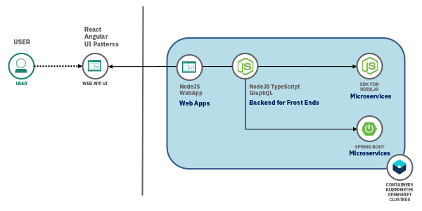
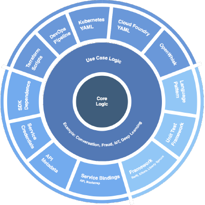

# Starter Kits

## Overview

To complement the IBM Cloud-Native Toolkit this project provides a set of **Starter Kits**. These have been designed to support build to manage and give a production ready entry point for cloud-native development. While the use of the **Starter Kits** is not required to be able to use the development tools, their use is **highly recommended** to get up and running quickly.

There are a small number of **Starter Kit** git repositories that provide
 support for different architecture layers of your cloud native solution these includes:

- User Interfaces
- Backend for Frontends
- Microservices
- Edge Apps

You can pick the **Starter Kit** that best meets your requirements and it will seamlessly integrate with the installed development tools.

You can work with more [Starter Kits](https://developer.ibm.com/patterns/){: target=_blank} from [developer.ibm.com](https://developer.ibm.com/){: target=_blank}.  These patterns can be "enabled" using the `Bring your own code` approach on [Starter Kits Docs](starter-kits.md). Even though they are "enabled" they are not optimized for production usage and do not include a number of key IBM Garage best practices.  They are fully open source and they can be enhanced overtime.

You can also work with the **Starter Kits** provided from the IBM Cloud [IBM Cloud Starter Kits](https://cloud.ibm.com/developer/appservice/starter-kits){: target=_blank} for the server side patterns you can "enable" these using the `enable` command on [Cloud-Native Command Line Interface](../cli.md#enable){: target=_blank}

There is more information below on what is included in the **Starter Kits**.

## Why another Starter Kit

As teams have built out production solutions using IBM Kubernetes Services and Red Hat OpenShift
on the IBM Cloud it has became clear that starting with a `hello-world` style code slows down an agile team.

In cases where you are learning the basic principles of cloud-native development with a specific language it does help to start with the basic principles of `hello-world` but when you are building production code to be used by real users it takes a lot of effort to industrialize this code ready for production.

The objective of these *Starter Kits* is to kick off a project quickly so they can reach maximum development velocity in the least amount of time. To not contain any business logic and to have a set of proven opinionated frameworks that are commonly used in the industry this can include `Express`, `React` and testing frameworks.

Why Starter Kits ? As the approach to cloud native microservice development has evolved
a number of language frameworks have come into play, runtime configuration technologies and best practices to improve quality and robustness. It becomes very time consuming to create, manage and maintain these elements.

{style="width: 80%" .center }

If we look at a typical cloud-native app, they require a number of supporting files, similar to the ones
found in the outer ring of this diagram. They take time to create and are only often needed for the initial seed of the project. Its also never clear where the documentation is for these elements and how they are work together.

Some typical examples :

- Dockerfile
- Helm chart
- CI pipeline ([Jenkins](../../reference/tools/jenkins.md){: target=_blank}, [Tekton](../../reference/tools/tekton.md){: target=_blank}, etc.)
- TDD Frameworks
- Tracing
- Code Analysis
- Monitoring / Logging Support
- Cloud Service bindings and credentials
- User Case logic UI, BFF, Microservice

The **Starter Kits** provide a key number of these supporting files and meta data
 and are tested on every code change to make sure they work with IBM
  Kubernetes and IBM Red Hat OpenShift managed clusters environments.

## Starter Kit Template

The purpose of the Starter Kit is to provide the scaffold code for the elements outside of your working
use case business logic. This will then allow a developer to get started a lot quicker and allow you to push code regularly into your CI environment. This code is optimized for build to manage scenarios where where logging, health are fully integrated.

## What constitutes a good Starter Kit

If you want to contribute a **Starter Kit** have a look at the examples that are provided. They all have most of the features listed below. They must be UBI ([Universal Base Image](https://www.redhat.com/en/blog/introducing-red-hat-universal-base-image){: target=_blank}) based so they can run in Red Hat OpenShift as well as Kubernetes. They must have a `Dockerfile` that uses that UBI. To make them work with continuous integration, you can provide a Jenkins or Tekton pipeline. In some cases for Edge they base images may be different as they are optimized for size.

Make sure there is a good use case that is repeatable in your solution architecture. Make sure the code is documented and includes a `README.md'. There is good code coverage for tests and you have integrated SonarQube code scanning on the build process. Finally them put in open source so other developers can enhance, improve or consume.

- README
- License
- Package.json
- Use case example source code for example APIs, UIs, Dashboards, Machine learning models
- Unit test framework
- Pact test framework
- Integration testing including User Experience tests
- SonarQube scan integration
- Dockerfile using Universal Base Image
- Helm chart that is production ready
- Jenkinsfile or Tekton pipeline that is production ready
- Make it Open Source
