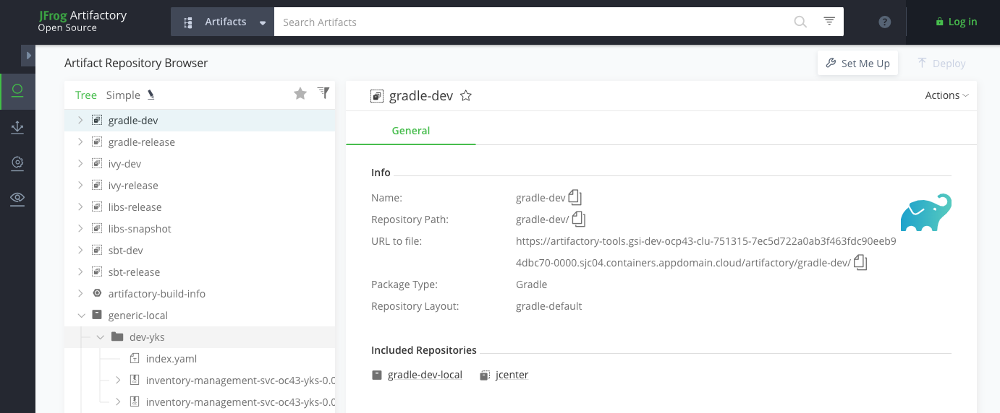
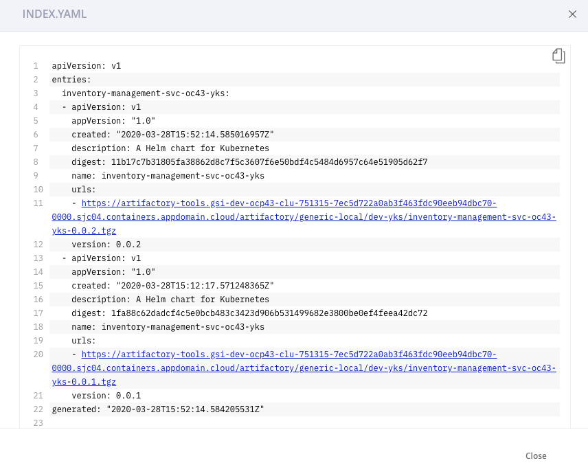
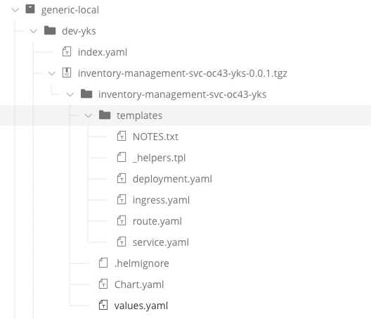

# Artifactory

Use Artifactory to store artifacts such as Helm charts and maven assets

In IBM Garage Method, one of the Develop practices is to [automate continuous delivery through a delivery pipeline](https://www.ibm.com/garage/method/practices/deliver/practice_delivery_pipeline/){: target=_blank}, in part by using an artifact repository for storing output of the build stage. The environment uses Artifactory as an artifact repository manager, which it uses to host its Helm repository.

## What is Artifactory

[Artifactory](https://jfrog.com/artifactory/){: target=_blank} is an artifact management repository.

An artifact repository manager hosts multiple binary repositories, like a database management system for artifacts. The binary repository compliments the source code repository: the code from an SCM is the input to the build process, whereas a binary repository stores the output of the build process, often called artifacts. The artifacts are often individual application components that can later be assembled into a full product.

An artifact repository manager is an integral part of a CI/CD solution, a companion to the pipeline. As the pipeline builds artifacts, they're stored in the repositories. When the pipeline later needs artifacts that have already been built, they're retrieved from the repositories. This enables a build to be broken into smaller stages with well-defined inputs and outputs and provides better tracking of each stage's results. Often a failed pipeline can restart in the middle using artifacts that were already built and stored.

An artifact repository often serves as the storage for a package manager, which assembles an application from artifacts. Here are some common package managers and their repositories:

- [**Maven**](https://maven.apache.org){: target=_blank}: Builds Java artifacts (such as Jar, War, Ear, etc.) and projects stored in [Maven repositories](https://maven.apache.org/guides/introduction/introduction-to-repositories.html){: target=_blank} such as [Maven Central](https://maven.apache.org/repository/index.html){: target=_blank}
- [**npm**](https://docs.npmjs.com/about-npm/){: target=_blank}: Assembles programs from JavaScript packages stored in [npm-registries](https://docs.npmjs.com/misc/registry){: target=_blank} such as the [public npm registry](https://docs.npmjs.com/about-the-public-npm-registry){: target=_blank}
- [**PIP**](https://pypi.org/project/pip/){: target=_blank}: Installs Python packages from [index repositories](https://packaging.python.org/guides/hosting-your-own-index/){: target=_blank} such as the [Python Package Index (PyPI)](https://pypi.org/){: target=_blank}
- [**Helm**](https://helm.sh){: target=_blank}: Deploys applications to Kubernetes using charts stored in [Helm repositories](https://helm.sh/docs/chart_repository/){: target=_blank} such as the [Helm Hub](https://helm.sh/blog/intro-helm-hub/){: target=_blank} catalog of repositories

Docker is not a package manager, but its architecture includes an artifact repository:

- [**Docker**](https://www.docker.com/){: target=_blank}: Stores images in [Docker registries](https://docs.docker.com/registry/){: target=_blank} such as [Docker Hub](https://docs.docker.com/docker-hub/){: target=_blank}

Note that you do not need a very large team to start reaping benefits from an artifact repository manager. The initial investment is not very large and the benefits are felt immediately.

## Artifact management in the Pipeline

Note: Be sure to [set up Artifactory](../../adopting/admin/artifactory-setup.md){: target=_blank} before using it in the Development Tools environment, if you are using external Artifactory that was not set up as part of the toolkit installation.

The environment will eventually be extended to store a number of artifact types in Artifactory. Thus far, the CI and CD pipelines exchange two types of artifacts: Docker images and Helm charts. The CI pipeline ([Jenkins](jenkins.md){: target=_blank}, [Tekton](tekton.md){: target=_blank}, etc.) builds these artifacts and ArgoCD deploys them. To store and share the artifacts, the pipeline uses two repositories:

- **Docker images**: The [Developer Tools Image Registry](ibm-cloud-container-registry.md){: target=_blank}
- **Helm charts**: A Helm repository in Artifactory

The [templates](../starter-kit/starter-kit.md){: target=_blank} have also been configured to store their Helm charts in Artificatory.

Artifactory is part of the environment's complete CI/CD solution:

- [Continuous Integration](../../learning/fast-ci.md){: target=_blank}
- [Continuous Delivery]../../learning/fast-cd.md){: target=_blank}

### Artifactory dashboard

Use the Artifactory dashboard to browse the repositories and their artifacts.

Open the Artifactory web UI for your environment.

- Use the [Developer Dashboard](../dashboard.md){: target=_blank} to open the Artifactory dashboard

Browse the Helm repository.

- Go to the Artifact Repository Browser page
- Expand the tree for the `generic-local` repository, which is the Helm repository
- Expand the branch for your environment's cluster, such as `showcase-dev-iks`

The artifacts in the cluster's branch follow the [Helm chart repository](https://helm.sh/docs/chart_repository/){: target=_blank} structure:

- **index.yaml**: Helm's index of all of the charts in the repository
- **charts**: The `tgz` files named for the application they deploy
      

Browse the artifacts to see how a Helm repository is organized.

- Select the `index.yaml` file and View it to see its contents
      
- Expand a chart's branch to see that the `tgz` file contains the chart directory structure
      

Notice that each chart has its own URL in Artifactory, and index lists the URL for a chart.

## Conclusion

The environment includes an artifact repository manager called Artifactory, which it uses to host a Helm repository.
As the CI pipeline builds the Helm chart for an application, it stores the chart in the Artifactory repository. When the ArgoCD pipeline deploys an application, it retrieves the chart from the Artifactory repository.
